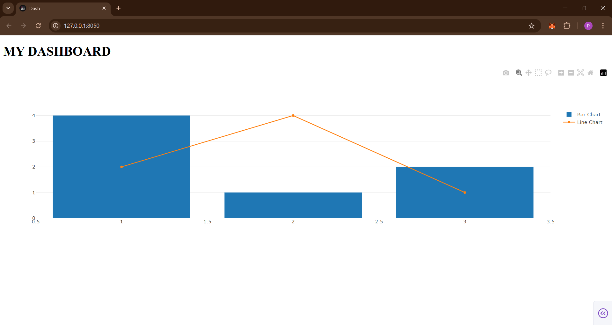
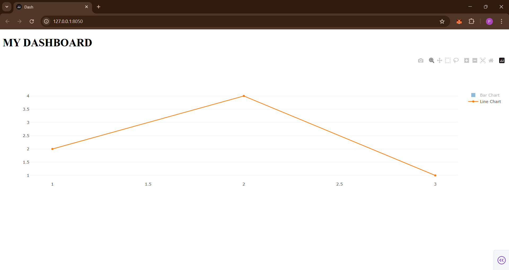

# 📊 Simple Dash Dashboard Project

This is a basic interactive dashboard built using [Dash](https://dash.plotly.com/), a powerful Python framework for building web applications with data visualization.

---

## 🚀 Project Overview

This dashboard demonstrates how to use Dash to create a simple web interface with:

- 📈 A **Bar Chart**
- 📉 A **Line Chart**
- 🧠 Titles and axis labels

---

## 📂 Project Structure

dashboard/
│
├── main.py # Main Python file that runs the Dash app
├── requirements.txt # Required Python packages
└── README.md # This file

yaml
Copy
Edit

---

## 💻 How to Run the Project

### 1️⃣ Clone the Repo

```bash
git clone https://github.com/your-username/your-repo-name.git
cd your-repo-name
2️⃣ Create a Virtual Environment (optional but recommended)
bash
Copy
Edit
python -m venv venv
venv\Scripts\activate    # On Windows
# OR
source venv/bin/activate # On Mac/Linux
3️⃣ Install Requirements
bash
Copy
Edit
pip install -r requirements.txt
4️⃣ Run the App
bash
Copy
Edit
python main.py
Then open your browser and go to:
http://127.0.0.1:8050/

🛠️ Tech Stack
Python 🐍

Dash (by Plotly) 📊


## 📷 Screenshots

###Main Dashboard View



### Bar Graph


###Line Graph



---

📌 Features
Simple, interactive layout

Real-time plotting

Beginner-friendly code

Easy to customize

🧪 Future Improvements
Add dropdowns or sliders for dynamic data

Use Pandas for real data analysis

Add Bootstrap or CSS for better styling

🤝 Contributing
Pull requests are welcome! For major changes, please open an issue first to discuss what you'd like to change.

📄 License
This project is open-source and available under the MIT License.

✨ Credits
Created with ❤️ by [Your Name]
Follow me on LinkedIn | GitHub
